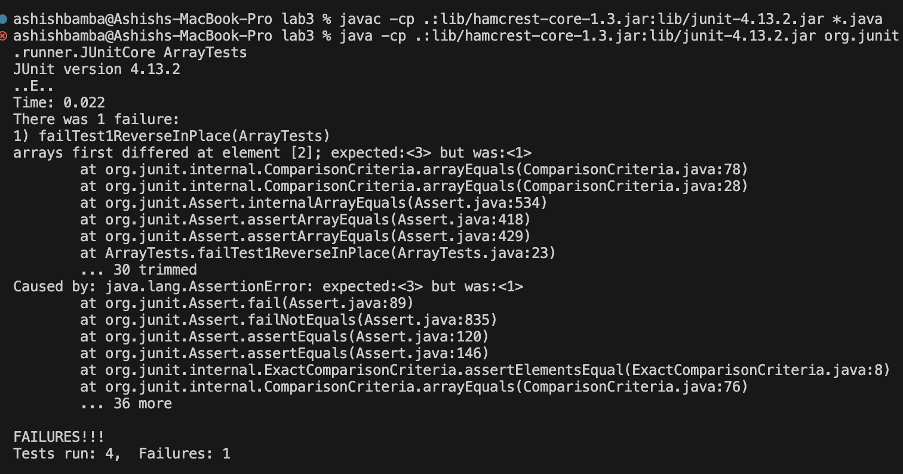
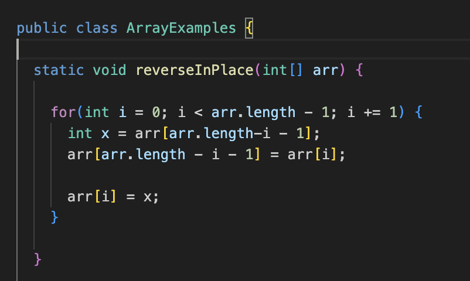
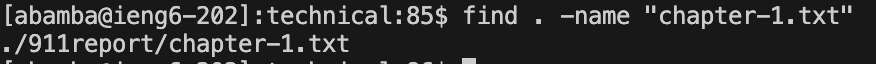
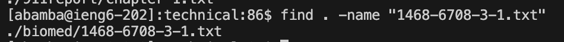
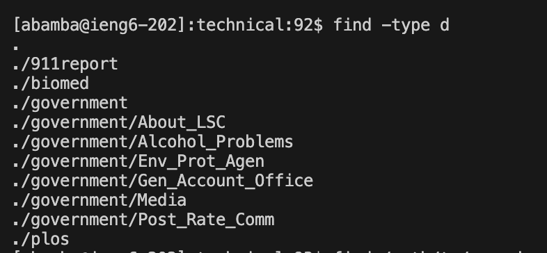
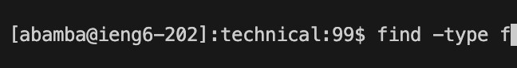
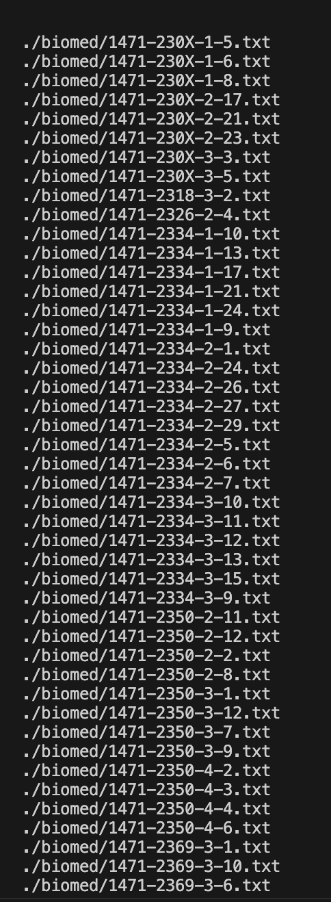
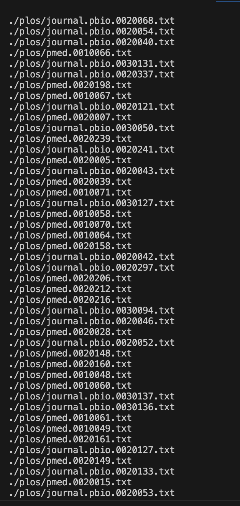

PART 1: Bugs

1.) A failure input for the reverseInPlace() is the array {1, 2, 3}.

Here is the appropriate JUnit Test:

 `@Test
  public void failTest1ReverseInPlace() {
    int[] input1 = {1, 2, 3};
    ArrayExamples.reverseInPlace(input1);
    assertArrayEquals(input1, new int[]{3,2,1});
  }`

2.) An input that does not induce a failure in reverseInPlace() is the array {5}. 

` @Test
  public void failTest1ReverseInPlace() {
    int[] input1 = {5};
    ArrayExamples.reverseInPlace(input1);
    assertArrayEquals(input1, new int[]{5});
  } `

3.) 

4.) INITIAL (BUGGY) CODE

FIXED CODE

PART 2: Command Options

1.) One option for the `find` command is the `. -name` command. Here are examples of its usages:

Over here, we used the name command to direct the find command to a specific file in the 911report directory, and it found it and returned the pathway.

Over here, we used the name command to direct the find command to a specific file in the biomed directory, and it found it and returned the pathway.

2.)  One option for the `find` command is the `-type ` command. Here are examples of its usages:

Over here, we are using the `-type` command to filter the search of `find` for only directories

Over here, we are using the `-type` command to filter the search of `find` for only files

3.) One option for the `find` command is the `. -maxdepth ` command. Here are examples of its usages

Over here, we are using the `-maxDepth` command to filter the search depth of `find` to a maximum of 2 levels, but it won't go any deeper than this

Over here, we are using the `-maxDepth` command to filter the search of `find` for 0 directories below the current directory (so it searches for nothing).

4.) One option for the `find` command is the `. -mindepth ` command. Here are examples of its usages:

Over here, we are using the `-minDepth` command to filter the search depth of `find` to a minimum of 2 levels, so it will go to a depth of atleast 2 levels below the starting directory.

