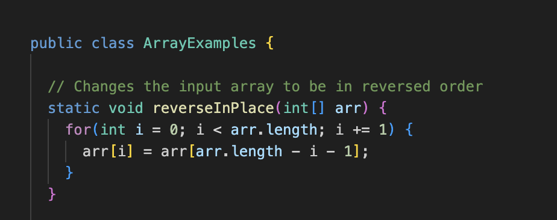

PART 1: Bugs

1.) A failure input for the reverseInPlace() is the array {1, 2, 3}.

Here is the appropriate JUnit Test:

 `@Test
  public void failTest1ReverseInPlace() {
    int[] input1 = {1, 2, 3};
    ArrayExamples.reverseInPlace(input1);
    assertArrayEquals(input1, new int[]{3,2,1});
  }`

2.) An input that does not induce a failure in reverseInPlace() is the array {5}. 

` @Test
  public void failTest1ReverseInPlace() {
    int[] input1 = {5};
    ArrayExamples.reverseInPlace(input1);
    assertArrayEquals(input1, new int[]{5});
  } `

3.) 

4.) INITIAL (BUGGY) CODE

FIXED CODE

PART 2: Command Options

1.) One option for the `find` command is the `. -name` command. Here are examples of its usages:

